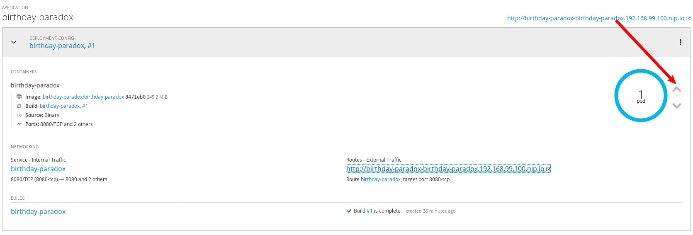

# Lab: Birthday-Paradox
Welcome to the lab! Today, we'll deploy a simple Spring-Boot application to OpenShift called `birthday-paradox` (https://en.wikipedia.org/wiki/Birthday_problem). We'll also check out some other great features of OpenShift!

First, go ahead and clone this repo:
```
git clone git@github.com:deweya/OpenShift-Basic-Lab.git
```

## Log into OpenShift
Minishift provides a command that will take you to OpenShift on your browser. Run:
```
minishift console
```

If you didn't accept the security exception in the prereq, you'll need to do that now to access the OpenShift UI. You'll then need to authenticate. Minishift creates a user called "developer" for you by default. Enter "developer" for the username and any string for the password.

You should see one project called "myproject". This project is created by default. We'll use our own project for the application, so create a new project on OpenShift using the command line:
```
oc new-project birthday-paradox
```

Select the new project on the UI to enter your project.

## Deploy Birthday-Paradox
This section will show how to build code using OpenShift's "binary build", as well as how to deploy an application using the built image.

### Build the Code
Navigate to `OpenShift-Basic-Lab/lab` (containing pom.xml) and run:
```
oc new-build --name=birthday-paradox registry.access.redhat.com/redhat-openjdk-18/openjdk18-openshift --binary
```
This will configure (but not start) an OpenShift build called a "BuildConfig". It will name the build "birthday-paradox" and will specify the location of an "openjdk" image to use as a base image for the build. It will also declare the build as "binary", meaning that we will be supplying the code from a local directory.

Let's start this build with 
```
oc start-build birthday-paradox --from-dir=.
```
and follow its progress with 
```
oc logs -f bc/birthday-paradox
```
You'll know when the build has finished because the logs command will terminate.

At this point we have created a brand new image containing a packaged war file of our source code. Let's deploy this application with
```
oc new-app birthday-paradox
```
By now, you should see on the UI that there is one pod running containing this application.

By default, OpenShift applications are not exposed to the network. Create a route to access this application with 
```
oc expose svc/birthday-paradox
```

## Accessing the Application
On the OpenShift UI, you should see a link to the birthday-paradox application. Click this link to access the app.

Congratulations! You have deployed your first application on OpenShift!

## Scaling the Application
Currently, there is only one instance of `birthday-paradox` running on your OpenShift cluster. Let's learn how to scale up our application using the UI.

On the OpenShift UI, you should see a blue circle that says "1 pod" in the middle. To the right of the circle, click the up arrow twice to spin up two more instances of the application.



Notice how those extra instances spin up in seconds! In those few seconds, OpenShift created two more containers running the app and allowed them to be load-balanced with the original instance. This is very handy when traffic increases. When an app is taking on too much traffic, admins can simply scale up the application to even out the load. When the traffic subsides, the app can be scaled back down.

Feel free to scale the application back down to 1 instance by clicking the down arrow twice.

## Modifying the Application
One cool thing that we can do with a binary build is we can modify the app locally and push changes to OpenShift. This is great for testing, where it might be good to check for regressions before committing to source control.

Feel free to add some markdown text to `src/main/resources/templates/index.html`. Navigate to the lab root (containing pom.xml) and re-run the build:
```
oc start-build birthday-paradox --from-dir=.
oc logs -f bc/birthday-paradox
```

You should see the pod restart once the build is finished. Observe your markdown changes in the new instance!

## Resources
Here are a few links about things we worked on today:
- https://docs.openshift.com/container-platform/3.11/dev_guide/dev_tutorials/binary_builds.html
- https://docs.openshift.com/container-platform/3.11/cli_reference/basic_cli_operations.html
- https://docs.openshift.com/container-platform/3.11/dev_guide/routes.html
